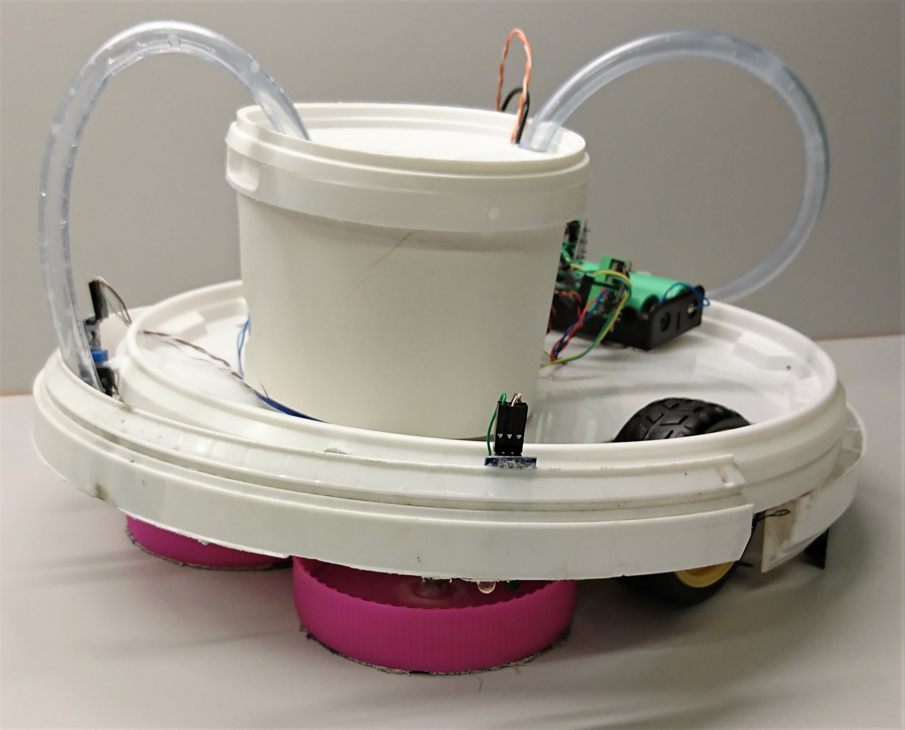

### Floor cleaning robot 
> Engineer's Thesis - Service robot design for home use.
 
## Table of contents
* [General info](#general-info)
* [Presentation](#presentation)
* [Technologies](#technologies)
* [Libraries](#libraries)
* [Features](#features)
* [Status](#status)
* [Contact](#contact)

## General info
This project was created as my Engineer's Thesis. For more details check first chapter in [Praca Inżynierska](./Documents/W04_235534_2019_praca%20inżynierska.pdf).

## Presentation

  
  

## Technologies
- C++ - std11
- Python - version 3.8
- Matlab - version 2018b
- Simulink - version 1.0
- Processing - version 3.5.3
- stm32duino - version 1.8.0
- PlatformIO IDE - verson 1.10.0

## Libraries
### C++/stm32duino
* Streaming - version 0.0.0-alpha+sha.5
* tone - stm32duino Standard Library
* wirish - stm32duino Standard Library
* pwm - stm32duino Standard Library
* math (avr-libc)- version 2.0.0
### Processing
* serial - Processing Standard Library
### Python
* matplotlib - version 3.3.1
* serial - Python Standard Library

## Features
Check section 1.2 and cheapter 3 in [Praca Inżynierska](./Documents/W04_235534_2019_praca%20inżynierska.pdf).

## Status
Project is: _finished_

## Contact
albert.lis.1996@gmail.com - feel free to contact me!
